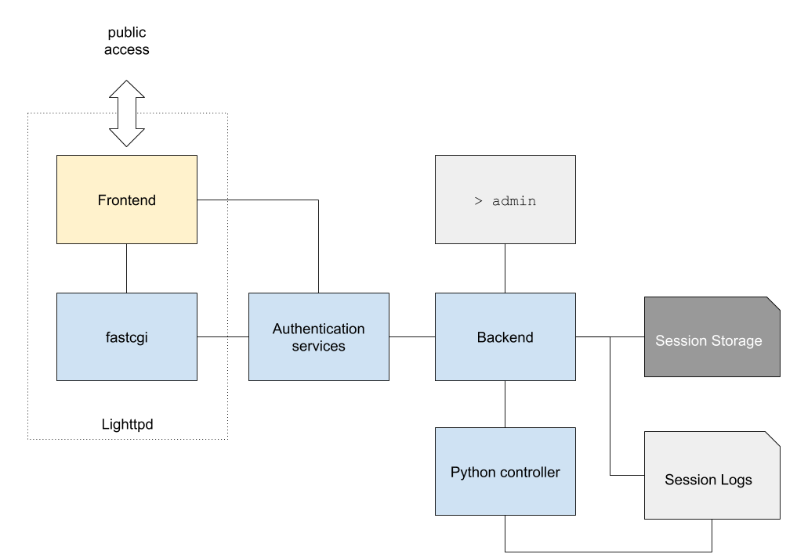

# Surveysystem
System for on-line and off-grid survey preparation and submissions


# Data storage

This system purposely uses a simplistic data storage scheme, in the
interests of robustness, and also making it easier to scale up and down,
and perform analysis on the data it collects.

The structure is relatively simple:

* `surveys/survey_name/current` - The current definition of a survey called "survey_name".
* `surveys/survey_name/<SHA1 hash>` - Older definitions of a survey, named after the SHA1 hash of the survey definition
* `python/nextquestion.py` - Python functions to select next question.
    - Next question provider: Functions should be named `nextquestion_<survey_name>_<SHA1 hash>`.  If no such function exists, then `nextquestion_<survey_name>` is tried, and failing that `nextquestion`.
    - Analysis provider: As above `analyse_<survey_name>_<SHA1 hash>`.  or `analyse_<survey_name>` or `analyse`.
* `sessions/<session uuid prefix>/<session uuid>` - Files containing each live session.  The prefix subdirectories are used to
prevent any given directory becoming too long, and slowing down the retrieval of a given survey.
* `logs/YYYY/MM/DD/YYYY-MM-DD-HH.log` - Log files of all activity

Stale sessions can simply be deleted via the file system, and surveys added or updated or deleted similarly easily.

## Environment Variables

**SURVVEY_HOME** (required):

All data lives in `SURVEY_HOME`. The `SURVEY_HOME` environment variable **must** be defined and represents an absolute directory path to the backend dir (no trailing slash).

**SURVEY_PYTHONDIR** (optional):

Optionally you can define an external Python controller path via `SURVEY_PYTHONDIR`. This must be an absolute directory path. The backend will look for `<SURVEY_PYTHONDIR>/nextquestion.py`. This is recommended for more complex analysis requirements.
If not defined the backend falls back to the local `<SURVEY_HOME>/python/nextquestion.py` (see structure)

**SURVEY_FORCE_PYINIT** (tests <span color="red">only!</span>):

If `SURVEY_FORCE_PYINIT` is set to `"1"` the Python interpreter will re-initialise on *every* Python C-Api function call.

Use this only for *testing* or *development* environments, as this substantially slows down the application and might cause side effects inside your python controller.


**SS_TRUSTED_MIDDLEWARE**:

Register a trusted authentication middleware source. For details see [authorisation-and-middleware.md](docs/authorisation-and-middleware.md)

# Installation (backend)

This system requires Python >= 3.8 and clang. Additionally, `zlib and bmake` is required for compiling [kcgi](https://kristaps.bsd.lv/kcgi/index.html). To install on Ubuntu:

```bash
sudo apt-get install clang make
sudo apt-get install python3.8 python3.8-dev
sudo apt-get install zlib1g-dev bmake
```

Tests require Lighttpd and Curl

```
sudo apt-get install curl lighttpd
```

Then make sure to build and install kcgi:

```bash
git submodule init
git submodule update
cd backend/kcgi
./configure
sudo bmake install
```

Then create a folder for logs:

```bash
mkdir surveysystem/backend/logs
sudo chmod 777 surveysystem/backend/logs
mkdir surveysystem/backend/testlog
sudo chmod 777 surveysystem/backend/testlog
```

# Overview



## REST API

Note that the following section reflects the *current state* of development and will be subject to future changes.

### Endpoint

 * `GET /surveyapi/<path>?<query>`

### Paths and queries

| Path                    | Action                                                                              | Method | Format           | Params                  | Return |
| ---                     | ---                                                                                 | ---    | ---              | ---                     |  ---       |
| **Session**             |                                                                                     |        |                  |                         |         |
| `newsession`            | create a new survey session                                                         | GET    | application/text | `?surveyid`             | session id |
| `newsession`            | (Authorized MW only) managed session, create a new survey session with a given uid  | POST   | application/text | `?surveyid&sessionid`   | session id |
| `delsession`            | delete current session                                                              | GET    | application/text | `?sessionid`            | -       |
| **Survey**              |                                                                                     |        |                  |                         |         |
| `nextquestion`          | get next questions                                                                  | GET    | application/json | `?sessionid`            | `{ status, message, next_questions[] }`<br> [next_questions response](docs/next-questions-response.md) |
| `addanswer`             | provide a single answer and get next questions                                      | GET(!) | application/json | `?sessionid&answer`     | `{ status, message, next_questions[] }`<br> [next_questions response](docs/next-questions-response.md) |
| `updateanswer`          | alias for addanswer                                                                 | GET(!) | application/json | `?sessionid&answer`     | `{ status, message, next_questions[] }`<br> [next_questions response](docs/next-questions-response.md) |
| `delanswer`             | remove a specific answer and get next questions                                     | GET    | application/json | `?sessionid&questionid` | `{ status, message, next_questions[] }`<br> [*updated* next_questions response](docs/next-questions-response.md) |
| `delanswerandfollowing` | remove all answers up to a specified question id and get next questions             | GET    | application/json | `?sessionid&questionid` | `{ status, message, next_questions[] }`<br> [*updated* next_questions response](docs/next-questions-response.md) |
| `analyse`               | fetch analysis of a completed survey                                                | GET    | application/json | `?sessionid`            | `{ feedback, report}`<br> survey analysis |
| **System**              |                                                                                     |        |                  |                         |         |
| `accesstest`            | check system (filesystem)                                                           | GET    | application/text | -                       | - |
| `fastcgitest`           | check survey access (fastcgi)                                                       | GET    | application/text | -                       | - |

The survey model is sequential. `/surveyapi/addanswer`, `/surveyapi/updateanswer` are required to submit the answers for question ids in the exact same order as they were recieved. Similar with `delanswer` requests, where question ids have to be submitted in the exact reverse order.

## Documentation

Documentation files live in [docs](docs/). The most important docs are about the [backend data serialisation model](docs/data-serialisation.md) and the [backend session life cycle](docs/sessions.md)
