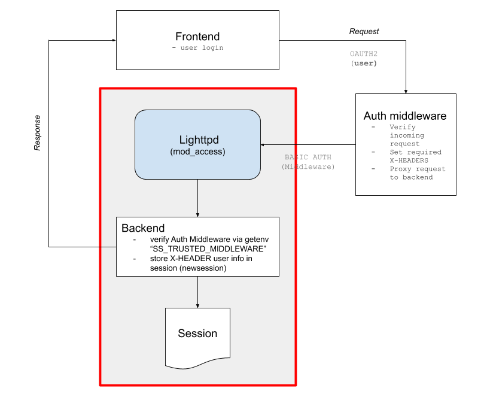

# Authorisation Middleware (fastgi only)

The survey system backend is not designed to handle authorisation and user management itself.

Access control (via fastcgi) can be implemented either by *(a)* direct authentication in front of fastcgi on server level or (*b)* via a trusted reverse proxy.

## (A) Direct authentication

* HTTP DIGEST: `user` and `realm` are reported into `@user` and `@group` session header.
* HTTP BASIC: Not recommended for production! User data are not recorded into the session. Should only be used for the internal authentication of an registered middleware (b)

## (B) Registration of a trusted authentication middleware

1) Configure backend *inward facing* using an internal, unexposed loopback address (127.0.0.0 to 127.255.255.255)

2) Register a *single, outward facing* middleware endpoint by setting the environment variable `SS_TRUSTED_MIDDLEWARE` in the format `<IP ADRESS>(<PORT>)` (i.e. `127.0.0.1(80)`)

3) The middleware needs to authenticate itself directly via HTTP BASIC or HTTP Digest (see a))

4) All requests within a session need to come from the *same middleware* (consistency verification). The middleware authentication credentials may change (ie. user, admin)

6) All middleware requests require the following *X-HEADERS* to be set:

 * `X-SurveyProxy-Auth-User`:  stored in session `@user` header when creating a new session
 * `X-SurveyProxy-Auth-Group`: stored in session `@group` header when creating a new session

 Both headers are *required for all requests* with in a session, but their actual values are not verified or updated in any requests other than `/newsession` (trusted middleware)

- Example lighttpd conf (excluding outward facing middleware) : [Lighttpd conf example](backend/tests/conf/lighttpd-proxy.conf.tpl)

